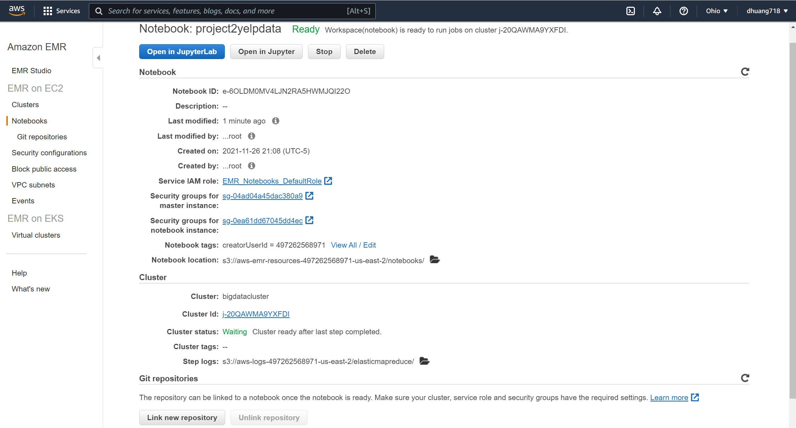
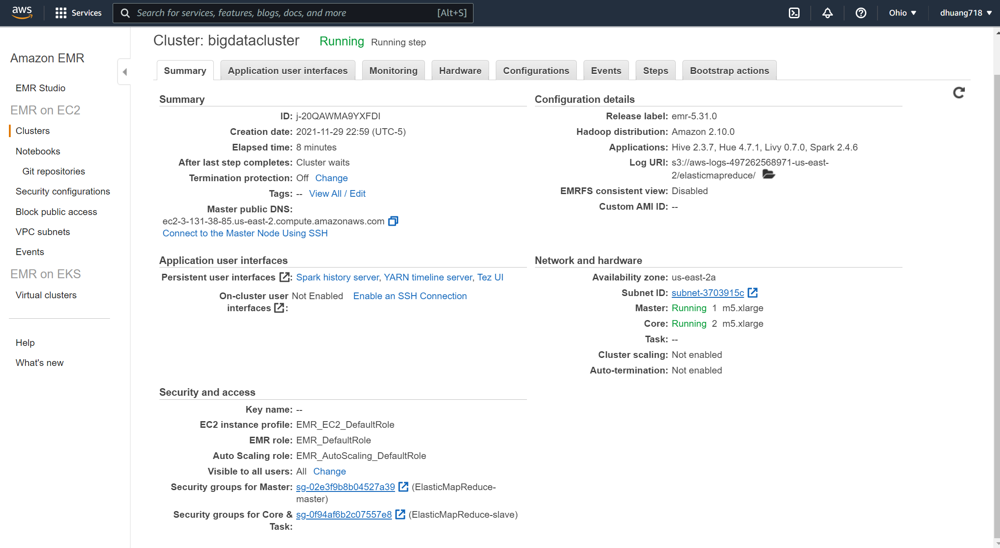

# Analyzing 10Gb of Yelp Reviews Data

For this project, I will use pyspark to analyze 10gb of Yelp data, including the following tables: business , review, and user. I will be using a python notebook with a pyspark kernel to conduct my analysis and show my understanding of utilizing Apache Spark technology. This project was done with AWS EMR. 

Link to Kaggle dataset used:
https://www.kaggle.com/yelp-dataset/yelp-dataset

I will be storing the data in my S3 bucket below:
's3://yelpdatasta9760/*'

## Analysis link

https://github.com/dhuang718/project02/blob/main/Analysis.ipynb

## Cluster and Notebook Configs

